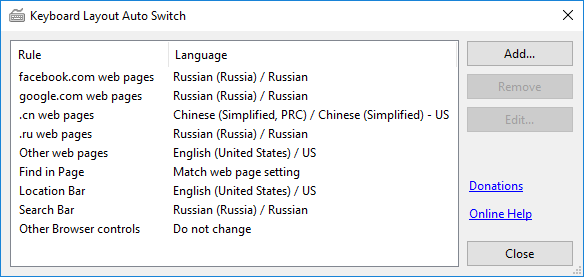
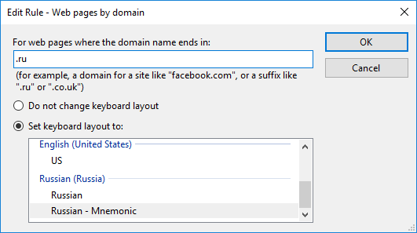

# KeyLayoutAutoSwitch
An automatic keyboard layout switcher for web browsers

This application aims to replace the old [TabLang](https://addons.mozilla.org/en-US/firefox/addon/tablang/) Add-on for Firefox. It can automatically switch the active input method (Keyboard layout and language) depending on which part of the browser has the focus. It can also switch depending on the url domain of the active tab. Different keyboard layouts can be defined for:

* The Location Bar
* The Search Bar (when shown separately)
* The Web Page content, optionally depending on the domain
* Find in Page
* All other parts of the browser

## Installation
KeyLayoutAutoSwitch is not an Add-on. Firefox no longer supports the technical requirements to implement this functionality within an add-on. Instead, it must be installed as a separate application, and must be running in the background to function. The installer offers the option to have it start with Windows. While running an icon will be shown in the notification area on the taskbar.

[Download Installer](https://github.com/AlexVallat/KeyLayoutAutoSwitch/releases/latest)

Some web sites, notably Google Docs, set a custom Aria document role on their pages. This prevents Firefox from reporting the URL for them through accessibility services. Most sites do not exhibit this problem, but if the ones you use do, then you can install the [Prevent Custom Document Role](https://addons.mozilla.org/firefox/addon/prevent-custom-document-role/) addon to work around the issue.

## Usage
Running KeyLayoutAutoSwitch will show the main configuration window. This can also be shown by double clicking on the icon in the notification area of the taskbar. In this window, the keyboard layout to use for each browser element can be set by selecting the relevant entry in the list and clicking the Edit button.

A different keyboard layout may be selected for each element, or any element may be set to "Do not change". If set to "Do not change", then KeyLayoutAutoSwitch will not switch the current keyboard layout when the relevant element is focused; it will remain at whatever it was last set to by any other element, or manually.

Additionally, keyboard layouts may be specified for web pages by domain. To add a new web page rule, click the "Add..." button. The domain for which the rule should apply can then be set. This can be an entire website domain (for example, facebook.com, google.com, etc.) or only the end part of it (for example, .ru, .fr, .co.uk, etc.). The most specific rule will be matched first, so if there is a rule for ".com" to switch to English layout, an addtional rule can be added for "facebook.com" to switch to Russian layout which will override it (as "facebook.com" is more specific than just ".com")

There is also a rule called "Previously visited web pages". This can be set to "Apply all rules normally" (Do not change), "Restore the last used keyboard layout for the page", or "Restore last used keyboard layout for the whole site". If set to restore the last layout, then KeyLayoutAutoSwitch will record the URLs you visit, and the keyboard layout you set for them. When returning to a tab or page, the last-used layout for that page is restored. If the option for the whole site is selected, then the same last-used layout applies to all pages under the same domain.

Note that the visited URLs are stored hashed, and in memory only. They are never written to disk. If the rules is set to "Apply all rules normally", URL hashes will not be stored at all. To immediately forget all stored visited URLs, use the menu command "Clear Previously Visited".

To exit KeyLayoutAutoSwitch entirely, right click on the notification area icon and choose "Exit". KeyLayoutAutoSwitch will no longer be running in the background, and will not change keyboard layouts until it is next run.

## Limitations
KeyLayoutAutoSwitch uses the Accessibility interfaces to obtain information from the web browser about which element is focused. If Accessibility services have been disabled in the browser it will not be able to function properly.

At present only Firefox is supported, although it is anticipated that support for other browsers may be added in the future.

KeyLayoutAutoSwitch is Windows only. Linux support would be nice to have, but is unlikely to happen soon, unless someone with knowledge of Linux accessibility services and Mono is willing to contribute development work to the project.

## Translation
Translations are welcome. To create a new translation, make a copy of all the files in the [`Localisation\qps-ploc`](https://github.com/AlexVallat/KeyLayoutAutoSwitch/tree/master/KeyLayoutAutoSwitch/Localisation/qps-ploc) folder into a new folder named with the language for the translation. Each .restext file must also be renamed to replace qps-ploc with the language name. For example, `Localisation\ru\Resources.ru.restext`, etc. A GenerateLocale.bat script is provided to automate this process.

Then, edit each .restext file to replace the English strings that appear between »» and ««, and remove the »» and «« marks (they are only there to highlight untranslated strings).

Translations may be submitted directly as pull-requests, or by attaching to an issue (and I will handle merging).

## Donations
Donations are very welcome, and may be made through PayPal by using the [Donate](http://keylayoutautoswitch.byalexv.co.uk/donate) link. Or you can send directly to me in any currency using <https://www.paypal.me/toalexv>.

## Changelog
v1.3:
* Added new option to Previously visited web pages rule, to apply the last used keyboard layout for the whole site (domain)
* Added context menu command to clear the previously visited web pages, forgetting all last used layouts
* Added context menu command to Add a Site Rule, pre-populated with the current site (if any) and layout
* Added tooltip to the icon which indicates why the current keyboard layout has been chosen
* Double clicking on the icon now only opens the configuration window if it is a left-click

v1.2:
* Updated compatibility with latest Firefox
* Fix mis-labelling of multiple language layouts for the same language

v1.1:
* Added the "Previously visited web pages" rule

v1.0:
* Initial Release